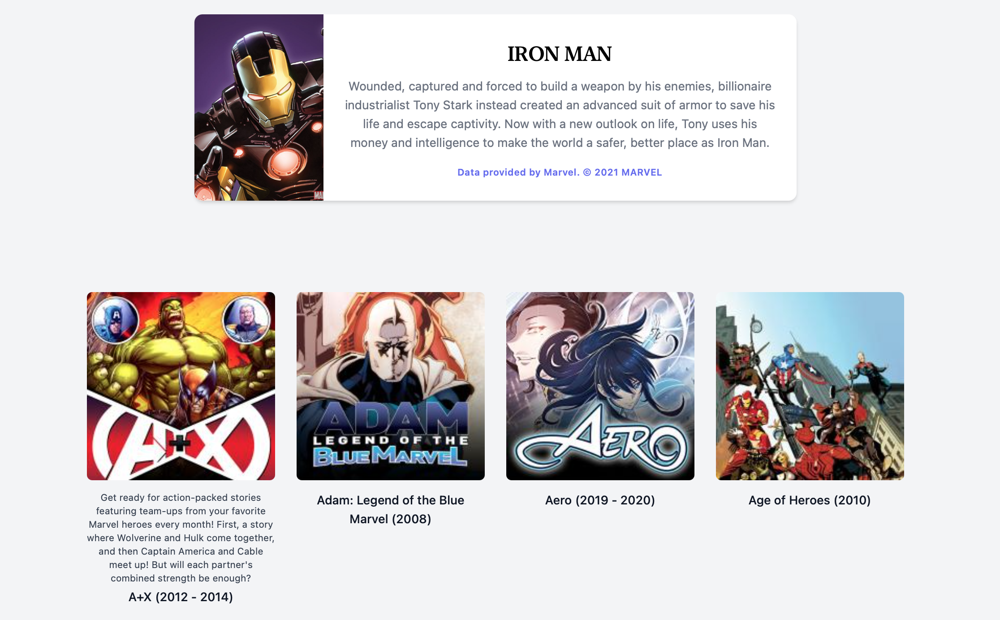
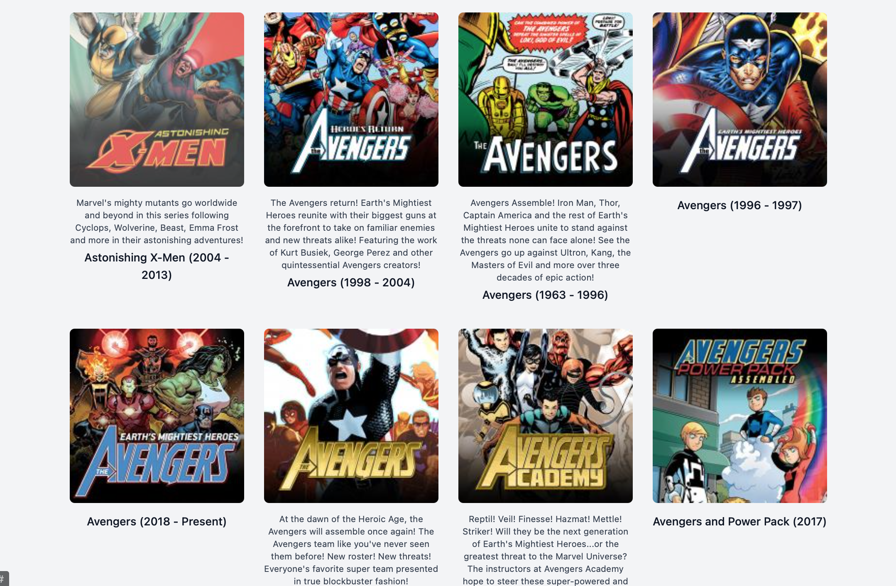

# Marvel Promoter

The `marvel_backends` branch can be used to integrate with [MarvelAPI](http://developer.marvel.com/docs) API using an elixir microservice gateway app.

## Getting Started

### Prerequisites

* Ruby: v3
* Rails: v6  
* Node: v12
* Erlang: v24
* Elixir: v1.12

> make sure the following commands for each repo are ran in x2 separate terminals and directories

### Setup the Rails Application

~~~bash
$ git clone git@github.com:BrandonTruter/marvel-promoter.git
$ cd marvel-promoter
$ git checkout marvel_backends
$ bundle install
$ yarn install
~~~


### Setup the Elixir Gateway

~~~bash
$ git clone git@github.com:BrandonTruter/marvel_gateway.git
$ cd marvel_gateway
$ mix deps.get
$ mix ecto.create
$ mix ecto.migrate
$ mix run priv/repo/seeds.exs
~~~

> for instructions to install erlang and elixir, please read the [README](http://developer.marvel.com/docs) of the elixir gateway repo


### Usage

Start servers on both applications:


  ```sh
  # Terminal 1 (rails app)
  rails s

  # Terminal 2 (rails app)
  ./bin/webpack-dev-server

  # Terminal 3 (elixir app)
  mix phx.server
  ```

Now you can open `http://localhost:3000/` in the browser and should see the landing page:

Marvel Character


Collection of series featuring the character

